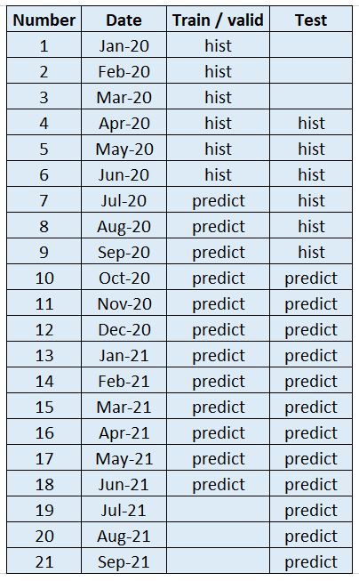
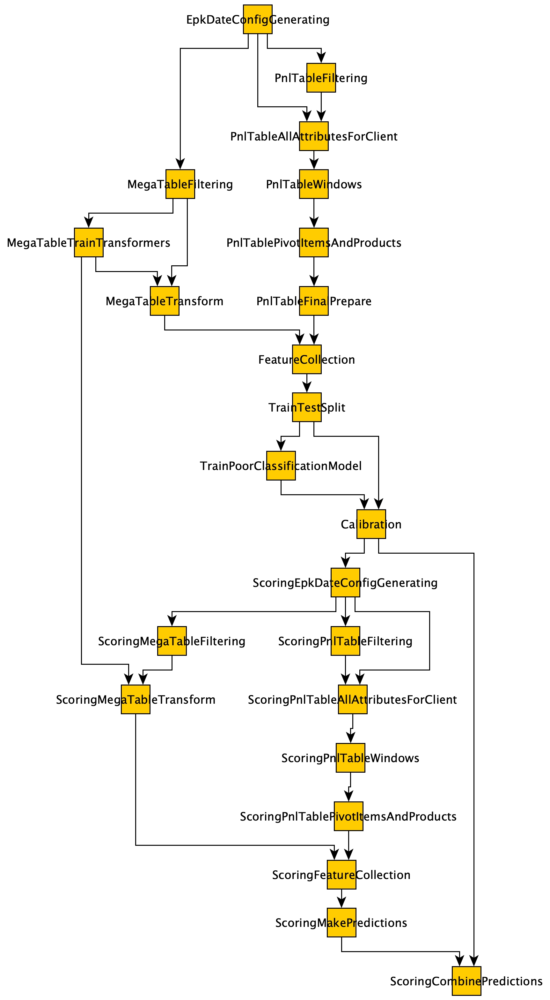

# Модель прогноза PnL клиента за год
Реализована в рамках решения задачи построения модели прогноза абсолютного CLTV клиента

### 1. Логика получения скоров

Суммарный прогноз PnL клиента за год получается путем суммирования прогнозов PnL клиента по каждому продукту.
В свою очередь, прогноз PnL клиента по продукту формируется из:
* прогноза PnL для клиентов с ненулевым PnL на момент предсказания (регрессия)
* прогноза PnL для клиентов с нулевым PnL на момент предсказания, являющимся произведением двух прогнозов:
  + прогноза вероятности того, что PnL станет ненулевым для клиентов с нулевым PnL на момент прогноза 
  (бинарная классификация)
  + прогноза PnL для клиентов с нулевым PnL на момент предсказания и ненулевым PnL в будущем (регрессия)

### 2. Временные периоды

Прогноз делается на 12 месяцев вперед, а в качестве фичей используется динамика изменения PnL за последние 
6 месяцев (временные интервалы можно изменить)
Все выборки train, valid и test строились по принципу out of sample, а test еще и out of time.
Помесячная разбивка представлена на рисунке ниже.

### 3. Источники данных

В качестве источников данных использовались:
1. Мегавитрина (все 1000 фичей): rozn_custom_rozn_client_aggr.ft_client_aggr_mnth_epk_td
   * пропуски в числовых фичах кодировались средним значением и нулями
   * даты кодировались интервалом (в днях) между report_dt (месяцем прогноза) и датой. Нули заменялись нулями
   * категориальные фичи кодировались через frequency encoding
2. Витрина с детальной разбивкой PnL в разрезе клиент, дата, продукт, компонента PnL: 
sbx_t_team_product_valuation.v_rcfr_data_cltv_fl_detail, где по каждому продукту и каждой компоненте считалась динамика 
их изменения за последние 6 месяцев, а именно (пропуски заменялись нулями):
   * max: максимльное значение за 6 месяцев
   * min: минимальное значение за 6 месяцев
   * mean: среднее значение за 6 месяцев
   * scatter: (max - min) / mean
   * delta_abs_mean: PnL_item_value_-1 - mean
   * delta_abs_min: PnL_item_value_-1 - PnL_item_value_-2
   * delta_abs_max: PnL_item_value_-1 - PnL_item_value_-6
   * delta_relative_mean: delta_abs_mean / mean
   * delta_relative_min: delta_abs_min / mean
   * delta_relative_max: delta_abs_max / mean

### 4. Пайплайн моделирования

Весь пайплайн построен только на PySpark (связано это как с особенностью вывода моделей в пром, так и с возможностью 
работы с большим датасетом)

ETL процесс выстроен с помощью библиотеки luigi, так что весь проект разделен на таски (tasks). Каждая таска 
запускается при выпонении предыдущей таски и, как правило, сохранения результатов работы предыдущей таски на диске 
или в hdfs. Таким образом получается цепочка взаимосвязанных тасок или граф вычислений (см. рисунок ниже).

Основные этапы работы:
1. Загрузка и предобработка данных
2. Моделирование
3. Получение метрик
4. Скоринг

Моделирование строилось по следующему принципу:
* на части клиентов обучается случайный лес и делается первичный отбор признаков по важности
* на части клиентов проводится подбор гиперпараметров градиентным бустингом, сохраняются метрики на valid и проводится 
дополнительная фильтрация фичей по важности
* выбрав оптимальные гиперпараметры и поднабор фичей, модель обучается на всем датасете
* в случае бинарной классификации нужны не просто скоры, а именно вероятности, поэтому проходит калибровка предсказаний
* получаются финальные метрики 

### 5. Входные данные

В директории config есть 3 json файла:
* mega_features_postfix_groups.json : информация о принадлежности фичей из мегавитрины к категориальным, числовым, ... 
фичам
* pnl_items_info.json : информация о группировке компонентов PnL по группам (далее компонента)
* pnl_products_info.json : информация о группировке подпродуктов PnL по группам (далее продукт)

Кроме того, входные данные берутся из файлa config/local.cfg (ниже их описание), где параметры задаются для каждой 
отдельной таски :

* local_result_path: локальная директория , в которую сохраняются основные результаты
* hdfs_project_path: директория в hdfs , в которую сохраняются основные результаты
* hdfs_result_path: директория в hdfs , в которую сохраняются промежуточные результаты тасок
*  
* pnl_detail_table: витрина PnL
* mega_table: мегавитрина 
*  
* pnl_products_info_path: путь к соответствующему файлу
* pnl_items_info_path: путь к соответствующему файлу
* mega_features_postfix_groups_path: путь к соответствующему файлу
*  
* scores_directory_name: имя директории со скорами
* sample_clients_hdfs_path: путь к сэмплу клиентов (если нужно работать не со всеми)
* sample_features_from_mega_path: путь к сэмплу фичей мегавитрины (если нужно работать только с заранее 
выбранными клиентами)
*  
* spark_conf: количество ресурсов для спарк сессии
*  
* count_history_months: количество месяцев, по которым смотрится историческая динамика компонент PnL 
* count_predict_months: количество месяцев для предсказания
*  
* report_dt_test_left_border: левая граница списка с прогнозными месяцами
* report_dt_test_count: количество прогнозных месяцев
* report_dt_train_left_border: левая граница списка с прогнозными месяцами
* report_dt_train_count: количество прогнозных месяцев
*  
* number_of_epk_bins: количество групп, на которые нужно разбить клиентов по хэшу
* epk_left_bin_border_train = левая граница списка с номерами групп клиентов
* epk_bins_count_train = количество групп клиентов
* epk_left_bin_border_test = левая граница списка с номерами групп клиентов
* epk_bins_count_test = количество групп клиентов
*  
* report_dt_scoring_left_border: аналог одноименного для скоринга
* report_dt_scoring_count: аналог одноименного для скоринга
* number_of_epk_bins_scoring: аналог одноименного для скоринга
* epk_left_bin_border_scoring: аналог одноименного для скоринга
* epk_bins_count_scoring: аналог одноименного для скоринга

### 6. Промежуточные результаты

В директорию local_result_path сохраняются промежуточные результаты:
* epk_date_config_generating.json : фильтры для загрузки информации не по всей витрине, 
а по конретным epk_id и report_dt
* mega_features_categorical_mapping.json : кодировка категориальных признаков мегавитрины
* mega_features_fill_na.json: правило замены нулей мегавитрины
* mega_features_groups.json : сортировка фичей мегавитрины по типам
* pnl_dataset_columns_groups.json : сортировка фичей витрины PnL по группам
* scoring_epk_date_config_generating.json : аналог одноименного для скоринга

### 7. Выходные данные

В директорию local_result_path/models_params сохраняются результаты моделирования:
* calibration_coefficients.json : калибровочные коэффициенты для бинарной классификации
* feature_importance_***.xlsx : важные фичи для единичной модели
* metrics_***.xlsx : метрики для единичной модели (на валидации)
* metrics_all.json : финальные метрики на test для комбинированных скоров в сравнении с наивным прогнозом 
(значение PnL  в последнем месяце будет сохранятся на протяжении года для каждого клиента)

   

